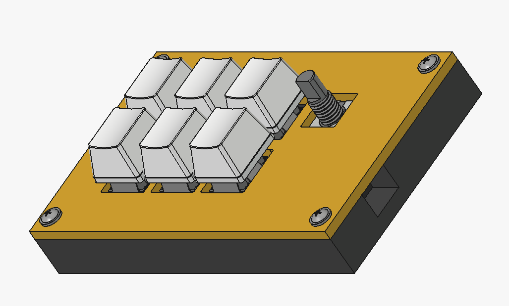
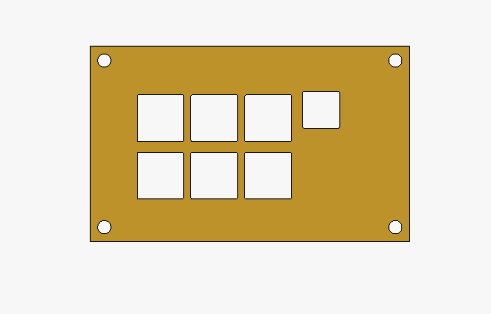
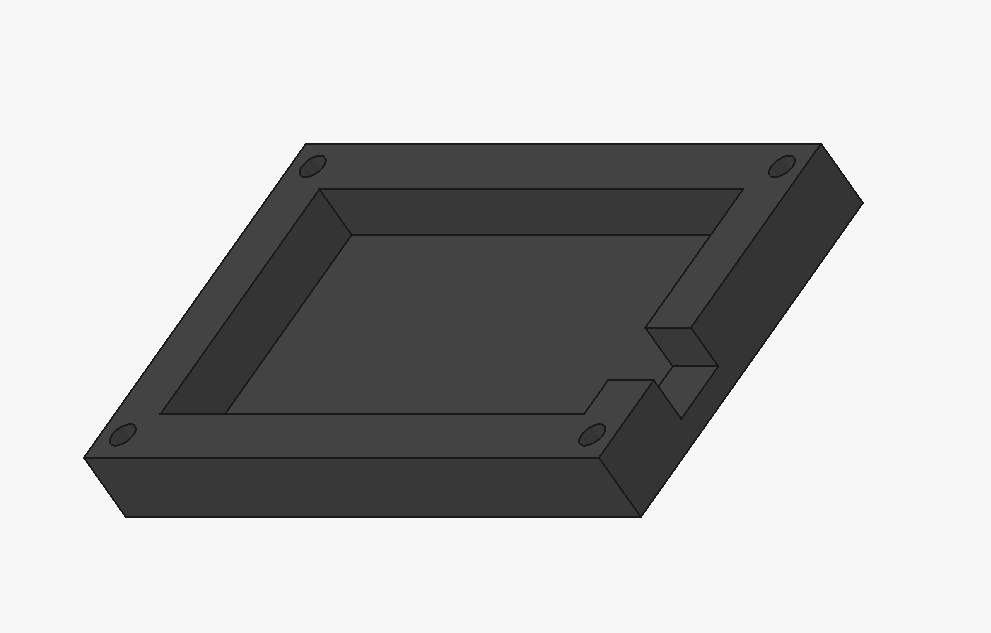
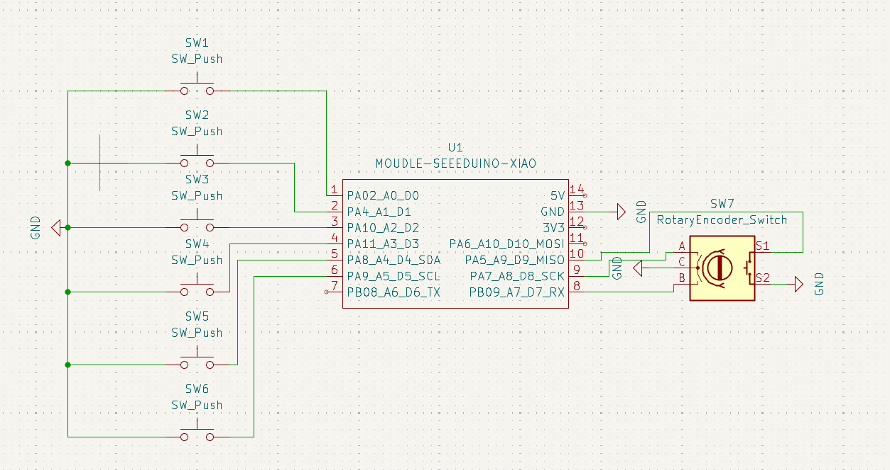
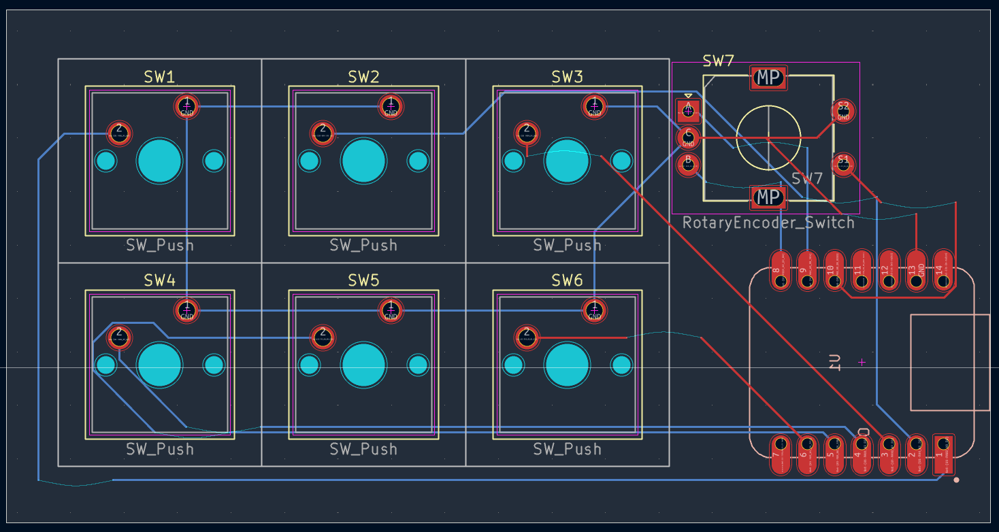

# ImtPad - Micropad, Project of Hack Club

Hi, I'm Imtiaz Ahmed. In the mission of hack club stardance.hackclub.com , I reverse engineered a 6 Button Micropad and made it exactly like his.
Here's the project in Stardance: https://stardance.hackclub.com/projects/2196

**Build Status: Ordered parts from online, they're taking time to arrive**
## Project Overall

## 3D Printed Parts 

Used while filament as yellow wasn't present.

## Schematics

## Footprint 

## PCB

## Ingredients needed to make this

- 3D Printed Case ( 2 Parts, Top and Bottom )
- 4x M3x5x4 Heatset Inserts
- 4x M3x16 Screws
- 6x Cherry MX Switches
- 6x Cherry DSA Keycaps
- 1x EC11 Rotary Encoder
- 1x XIAO RP2040

## Thanks to Hack Club.
Hack Club Stardance: stardance.hackclub.com
Register now through my link: https://stardance.space/r-aq7c7
ImtPad Project on Stardance: https://stardance.hackclub.com/projects/44849